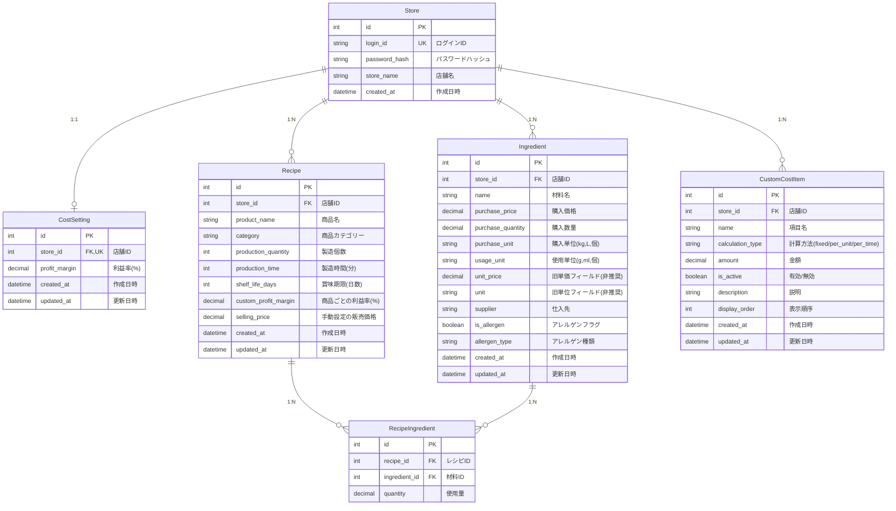

# データベースER図

## テーブル説明

### Store（店舗テーブル）
パン屋さんの店舗情報を管理。各店舗が独立したログインIDとパスワードを持つ。

### CostSetting（原価計算設定テーブル）
店舗ごとの基本利益率を設定。Storeとは1:1の関係。

### Ingredient（材料マスタテーブル）
材料の情報を管理。購入単位と使用単位を別々に管理し、自動で単位変換を行う。

### Recipe（レシピテーブル）
商品（パン等）のレシピ情報を管理。製造個数、時間、利益率、販売価格などを含む。

### RecipeIngredient（レシピ材料中間テーブル）
レシピと材料の多対多の関係を管理。各材料の使用量を記録。

### CustomCostItem（カスタム原価項目テーブル）
人件費、光熱費、包装費など、材料費以外の原価項目を管理。3つの計算方法をサポート：
- **fixed**: レシピ全体に対して固定金額
- **per_unit**: 製造個数あたりの単価
- **per_time**: 製造時間(分)あたりの単価

## リレーション

- **Store** は複数の **Ingredient**, **Recipe**, **CustomCostItem** を持つ
- **Store** は1つの **CostSetting** を持つ
- **Recipe** は複数の **RecipeIngredient** を通じて複数の **Ingredient** と関連
- **Ingredient** は複数の **RecipeIngredient** を通じて複数の **Recipe** と関連
